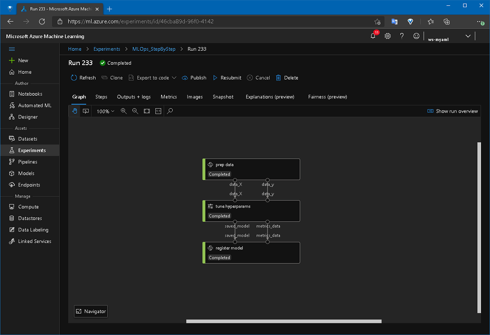
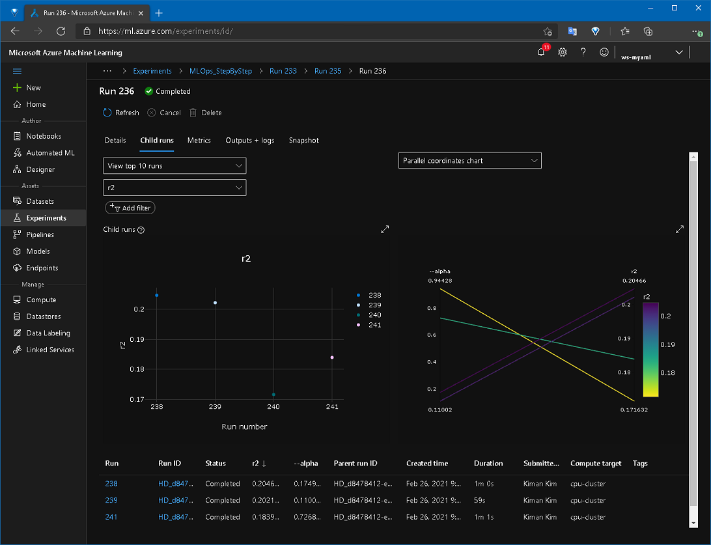

# Overview

이 샘플은 Hyper Parameter 튜닝을 위한 Azure Machine Learning Pipeline을 만드는 방법을 안내합니다.

__이 샘플이 설명해 주는 것__:

* Azure ML 에서 하이퍼 파라미터를 튜닝하는 단계를 생성합니다.
* 메트릭을 사용하는 방법을 다룹니다.

__이 샘플이 설명하지 않는 것__:

* Azure ML 파이프라인에 대한 기초는 설명하지 않습니다.

## Introduction

> 기존 ML script를 Azure ML Pipeline으로 wrapping하기: https://github.com/liupeirong/MLOpsManufacturing/tree/main/samples/wrapping-existing-ml-scripts-tutorial

위 예제에서, 우리는 기초적인 파이프라인을 완성하였습니다. 이번에는 기존 코드를 수정하여 하이퍼파라미터 튜닝을 사용하는 파이프라인으로 바꾸고 가장 성능이 좋은 모델을 얻으려고 합니다.

앞선 예제는 [Linear Regression](https://scikit-learn.org/stable/modules/generated/sklearn.linear_model.LinearRegression.html) 으로 되어 있었지만, 하이퍼파라미터 튜닝 예제를 위하여 [Ridge](https://scikit-learn.org/stable/modules/generated/sklearn.linear_model.Ridge.html) 로 수정하고 _alpha(Regularization strength)_ 를 하이퍼파라미터로 사용하도록 하겠습니다.

질문:

- 기존의 MLOps 파이프라인에 하이퍼 파라미터를 사용하기 위해서는 어떻게 해야 하나요?
- 하이퍼 파라미터를 사용한 훈련으로부터 어떻게 최적의 모델을 얻을 수 있나요?

이제부터 위 질문에 대한 답변을 단계벌로 살펴 봅시다!

# Getting Started

## 컨셉 이해하기

하이퍼파라미터 튜닝은 머신러닝에서 다루기 어려운 문제 중 하나이지만, 애저 클라우드를 사용하면 이 문제를 쉽게 해결 할 수 있습니다. 

파라미터 샘플링을 사용하여 하이퍼파라미터 값을 범위나 랜덤으로 지정할 수 있고, 동시에 훈련할 컴퓨팅 인스턴스의 수를 조절하여 훈련시간을 단축할 수도 있고, 성능이 떨어지는 훈련은 조기종료하여 리소스 비용을 아끼게 할 수도 있습니다.

기존 머신러닝 파이프라인 코드가 있다면 여러분은 아래 작업만 하면 됩니다.

  - hyper parameter 값과 관련 정책을 설정
  - hyper parameter를 넘겨 받도록 수정
  - 기존 train step을 hyper drive step으로 수정

이제 좀 더 자세하게 살펴보겠습니다!

## 하이퍼파라미터 설정하기

`ml_service/pipelines/hyperparams.py`에는 하이퍼파라미터 스텝을 쉽게 만들기 위한 헬퍼클래스가 정의되어 있고 그 아래에는 여러분이 설정해 주셔야 하는 설정값들이 정의되어 있습니다.

```python
# ml_service/pipelines/hyperparams.py
...
PARAMETER_SAMPLING = {
    '--alpha': uniform(0.05, 1.0)
}
PRIMARY_METRIC_NAME = 'r2'
PRIMARY_METRIC_GOAL = PrimaryMetricGoal.MAXIMIZE
EVALUATION_INTERVAL = 2
SLACK_FACTOR = 0.1
MAX_TOTAL_RUNS = 4
MAX_CONCURRENT_RUNS = 2
...
```

각 변수의 용도는 아래와 같습니다:
- PARAMETER_SAMPLING
  - 하이퍼파라미터로 사용할 변수를 선언하고 값의 형태를 지정합니다.
  - 위 예제에서는 `--alpha` 파라미터가 최소값 0.05, 최대값 1.0 범위에서 랜덤하게 균일 분포된 값을 가지게 됩니다.
  - [_RandomParameterSampling_](https://docs.microsoft.com/python/api/azureml-train-core/azureml.train.hyperdrive.randomparametersampling?view=azure-ml-py) 외에 다른 샘플링을 사용하려면 [여기](https://docs.microsoft.com/azure/machine-learning/how-to-tune-hyperparameters#sampling-the-hyperparameter-space) 를 참고 바랍니다.
- PRIMARY_METRIC_NAME, PRIMARY_METRIC_GOAL
  - 어떤 Metric을 기준으로 best model을 정할 것인지를 지정합니다.
  - 위 예제에서는 r2 값이 max 인 모델이 best 모델이라고 명시하고 있습니다.
- EVALUATION_INTERVAL, SLACK_FACTOR
  - Bandit Policy로 성능이 떨어지는 훈련을 조기종료 할 수 있습니다.
  - EVALUATION_INTERVAL는 정책을 수행하는 주기를 지정합니다.
  - SLACK_FACTOR는 지정된 비율만큼 조기종료가 되지 않게 합니다.
- MAX_TOTAL_RUNS, MAX_CONCURRENT_RUNS
  - Compute Cluster가 최대 실행 가능한 횟수와 최대 동시 실행 가능한 횟수를 지정합니다.
  - 위 예제에서는 동시에 2회씩 총 최대 4회의 훈련을 수행합니다.
  > 동시 실행 수는 Compute cluster에서 사용할 수있는 리소스에 따라 제한됩니다. 

파라미터 샘플링에 대해 자세한 설명을 보러면 https://docs.microsoft.com/azure/machine-learning/how-to-tune-hyperparameters 을 참고해 주십시오.

## 기존 코드 수정하기

위에서 파라미터로 alpha를 정의했으므로 `src/steps/02_train.py` 에서는 이 값을 받아서 사용할 수 있도록 수정해야 합니다.

```python
# src/steps/02_train.py
...
parser.add_argument('--alpha', type=float, default=0.1)
...
# train
model = Ridge(alpha=args.alpha)
model.fit(X_train, y_train)
...
```

## 파이프라인 빌드 수정하기

이제 파이프라인을 생성하는 코드에서 기존 트레이닝 스텝을 하이퍼 드라이브 스텝으로 변경합니다.

```python
# ml_service/pipelines/build_pipeline.py
...
# ===== hyper drive setup //
config = ScriptRunConfig(source_directory='src/steps',
                            script='02_train.py',
                            compute_target=env.aml_compute_name,
                            arguments=[
                                '--data_X', data_X,
                                '--data_y', data_y,
                                '--model_name', env.aml_model_name,
                                '--test_size', pipeparam_test_size
                            ],
                            environment=environment)

hd_config = HyperParams().get_hd_config(config)

metrics_output_name = 'metrics_output'
metrics_data = PipelineData(name='metrics_data',
                            datastore=ds,
                            pipeline_output_name=metrics_output_name)

best_model_output_name = 'best_model_output'
saved_model = PipelineData(name='saved_model',
                            datastore=ds,
                            pipeline_output_name=best_model_output_name,
                            training_output=TrainingOutput("Model", model_file="outputs/mymodel"))

step2 = HyperDriveStep(
    name='tune hyperparams',
    hyperdrive_config=hd_config,
    inputs=[data_X, data_y],
    outputs=[saved_model],
    metrics_output=metrics_data)
# ===== // hyper drive setup
...
```

_HyperDriveStep_ 을 사용하기 위해서는 _ScriptRunConfig_, _HyperDriveConfig_ 가 필요하며, 하이퍼드라이브가 실행되면서 출력되는 metrics 와 best 모델을 저장할 _PipelineData_ 를 연결해야 합니다.

## 파이프라인 실행하기
파이프라인을 실행하면 Compute Cluster 에 지정된 인스턴스 수와 hyperparams에 지정된 MAX_TOTAL_RUNS, MAX_CONCURRENT_RUNS 에 따라 훈련을 수행합니다.

$ python -m ml_service.pipelines.run_pipeline

> Compute Cluster 가 프로비저닝 되는데 시간이 걸릴 수 있습니다.

정상적으로 실행되면 아래 스크린 샷 처럼 현황을 볼 수 있으며,



Hyper drive step에서는 하이퍼파라미터값과 primary metric 으로 지정된 값의 변화 추이를 그래프로 볼 수 있으며, 이를 통해 하이퍼파라미터가 각 모델에 얼마나 영향을 주는지 분석 할 수 있습니다.



훈련이 끝나면 `ml_service/pipelines/hyperparams.py` 에서 primary metric에 설정한 대로 r2가 max한 모델이 best model로 등록됩니다.

# 결론
지금까지 기존 MLOps 코드를 하이퍼파라미터 튜닝을 위한 파이프라인으로 변경하는 기초적인 과정을 살펴봤습니다. 이제부터는 여러분이 원하는 하이퍼파라미터를 샘플링하여 모델의 정확도를 높이기 위한 작업을 시작해 보세요!

# References

- https://docs.microsoft.com/azure/machine-learning/how-to-tune-hyperparameters
- https://github.com/Azure/MachineLearningNotebooks/blob/master/how-to-use-azureml/machine-learning-pipelines/intro-to-pipelines/aml-pipelines-parameter-tuning-with-hyperdrive.ipynb
- https://docs.microsoft.com/python/api/azureml-pipeline-steps/azureml.pipeline.steps.hyper_drive_step.hyperdrivestep?view=azure-ml-py
- https://docs.microsoft.com/python/api/azureml-pipeline-core/azureml.pipeline.core.graph.trainingoutput?view=azure-ml-py
