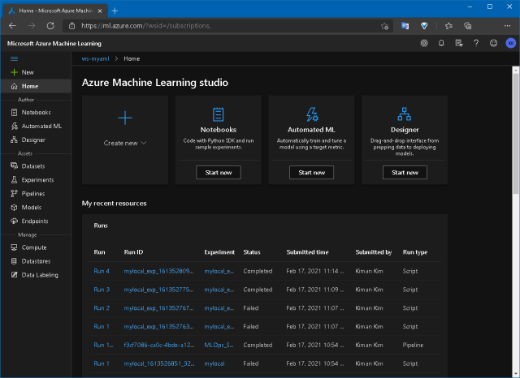
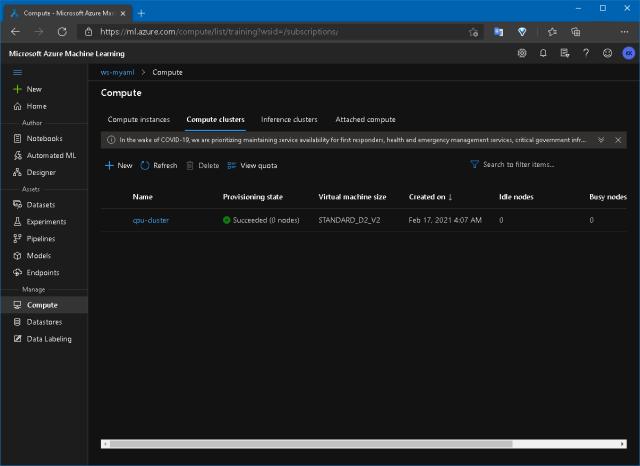
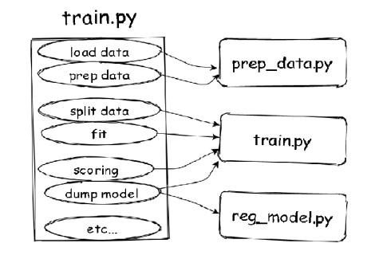
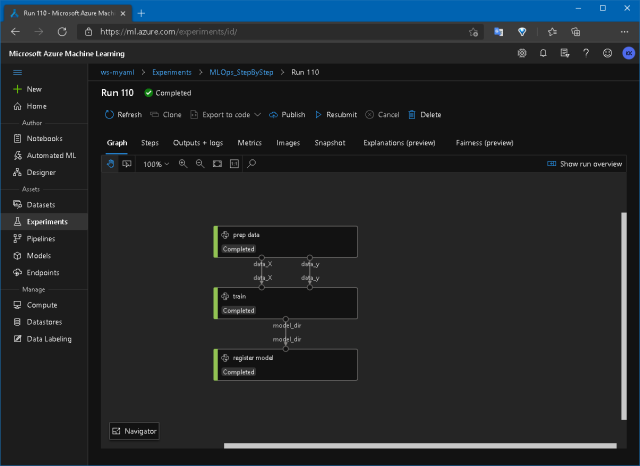
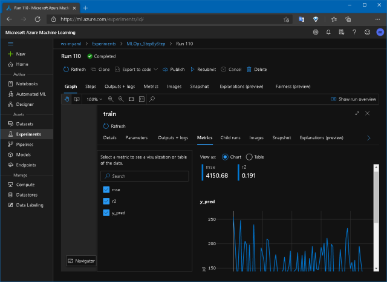
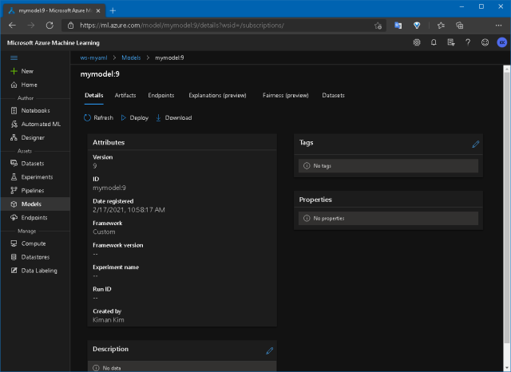

# Overview

이 예제는 당신의 머신러닝 코드를 Azure ML Pipeline 으로 옮기기 위한 매우 기초적인 작업을 안내하기 위한 예제입니다.

## Background

먼저 가상의 시나리오를 설정해 보겠습니다. 당신은 Scikit-learn을 사용한 간단한 당뇨병 선형 회귀분석(diabetes linear regression) 코드를 가지고 있습니다.

> Linear Regression Example: https://scikit-learn.org/stable/auto_examples/linear_model/plot_ols.html

- 이 코드를 Azure ML에서 사용하려면 어떻게 해야 할까요?
- 이를 MLOps로 만들려면 무엇을 해야 할까요?

이를 위해 간단한 모험을 떠나 봅시다! 

# Getting Started

## Prerequisite
- Visual Studio Code 설치: https://code.visualstudio.com
- Docker 설치: https://www.docker.com
- Azure 계정 가입: https://azure.microsoft.com/free

## Step 0. Setup dev environment

- 이 예제를 git clone 합니다.
- vscode를 사용하여 dev container로 이 예제를 엽니다.
  
  > 도커 이미지를 빌드해야 하기 때문에 첫 실행은 시간이 걸릴 수 있습니다.

  터미널을 열고 다음 과정을 수행해 주세요.:

- Azure CLI 설치 - [read more...](https://docs.microsoft.com/cli/azure/install-azure-cli-linux?pivots=apt)
  
  ```bash
  $ curl -sL https://aka.ms/InstallAzureCLIDeb | sudo bash
  ```
  
- Azure CLI 로 Azure에 로그인 - [read more...](https://docs.microsoft.com/cli/azure/install-azure-cli-linux?pivots=apt#sign-in-to-azure-with-the-azure-cli)

  ```bash
  $ az login
  ```

  > 여러 구독을 보유중일 경우, 사용할 구독을 설정하십시오.
  > ```bash
  > $ az account list -o table
  > $ az account set -s [Your subscription Id]
  > ```

- Conda dependencies 설치

  > 쉘 프롬프트에 콘다 환경 이름을 출력하도록 할 경우...
  > ```bash
  > $ conda init zsh && zsh 
  > ```
  ```bash
  $ conda env create --file environment_setup/conda_dependencies.yml
  $ conda activate my_conda
  ```

- 파이썬으로 Azure ML workspace 생성하기 - [참고](https://docs.microsoft.com/azure/machine-learning/how-to-manage-workspace?tabs=python#create-a-workspace)

  ```bash
  # 파일명을 */.env.example* 에서 */.env* 로 변경합니다
  # 이 파일을 열어 SUBSCRIPTION_ID 값을 수정합니다
  $ python -m environment_setup.provisioning.create_workspace
  ```
  > 30초 가량 시간이 걸릴 수 있습니다.

- 파이썬으로 Compute cluster 생성하기

  ```bash
  $ python -m environment_setup.provisioning.create_compute
  ```

- 이제 생성 된 Azure ML workspace 로 접속 해 봅시다!

  브라우저로 https://ml.azure.com/ 에 직접 접속하거나 https://portal.azure.com 을 통해서 접속 할 수 있습니다.

  

  Compute cluster 도 정상적으로 생성 되었는지 확인 해 봅시다.
  
  


## Step 1. train.py 실행해 보기

위에서 언급한 대로, 당신은 Scikit-learn으로 구현 된 간단한 당뇨 선형회귀 코드를 가지고 있습니다. 먼저 이 코드가 당신의 개발환경에서 정상적으로 동작하는지 확인 해 봅시다.

```bash
$ python -m src.train
Mean squared error:  4150.680189329983
Coefficient of determination:  0.19057346847560164
```

정상적으로 실행이 끝나면, 메트릭 값을 볼 수 있고 outputs 폴더에 *sklearn_regression_model.pkl* 파일과 *fig.png* 이미지 파일이 생성됩니다.


## Step 2. train.py 를 단계별로 쪼개기

이제 MLOps를 시작하기 위한 긴 여정이 시작됩니다. 첫 번째 작업은 기존 코드를 쪼개는 것 부터 시작합니다.
기존 코드는 1개의 단일 파일로도 잘 동작하지만, MLOps를 위해서는 각 단계를 세분화 할 필요가 있습니다.



몇 단계로 나눌지는 온전히 당신의 몫 입니다! 일단 여기서는 3 단계(Data Preparation, Train, Register Model)로 쪼개 보도록 하겠습니다. 쪼개는 작업의 결과물은 이미 *src/steps* 에 작업 해 두었습니다.

- *src/steps/01_prep_data.py*

  > diabetes 데이터를 다운로드하고, X,y로 나누고 1개의 feature만 사용하도록 데이터 준비

- *src/steps/02_train.py*

  > 학습을 수행하고 mse, r2score, matplot image를 출력하고 모델 생성

- *src/steps/03_reg_model.py*

  > Azure ML workspace에 모델을 등록

> 기존코드를 Azure ML 용으로 변경할 때, 보통은 *argparse*를 사용하여 매개변수를 다루거나 *Run.get_context()*를 사용하여 로그 코드를 추가하는 것이 대부분입니다. 물론 고급 기능을 위해선 더 해야할 일이 많겠지만요!

이제 당신의 로컬환경에서 각 코드가 잘 돌아가는지 테스트해 봅니다.

```bash
$ python -m src.steps.01_prep_data \
    --data_X=outputs/diabetes_X.csv \
    --data_y=outputs/diabetes_y.csv
$ python -m src.steps.02_train \
    --data_X=outputs/diabetes_X.csv \
    --data_y=outputs/diabetes_y.csv \
    --model_dir=outputs \
    --model_name=model.pkl \
    --test_size=0.2
$ python -m src.steps.03_reg_model \
    --model_dir=outputs \
    --model_name=model.pkl
```

문제 없이 실행되었다면 outputs 폴더에 csv 파일, 그래프 파일, pkl 파일이 생성된 것을 볼 수 있습니다.

## Step 3. AML에서 각 단계 실행해보기

이번에는 위 코드를 Azure에서 실행해 봅시다. MLOps 파이프라인을 만들기 전에, Azure ML 환경에서 위 코드가 잘 돌아가는지 개별 테스트를 할 필요가 있습니다.

```bash
$ python -m ml_service.run_local_compute
```

위 명령은 *src/steps/01_prep_data.py* 파일만 AML을 통해 실행되도록 합니다. 전체 MLOps 파이프라인을 실행하지 않아도 이와 같은 방법으로 단일 파일을 실행하여 각 단계를 테스트해 볼 수 있습니다.

```python
...
config = ScriptRunConfig(source_directory='src/steps',
                         script='01_prep_data.py',
                         compute_target='local',  # or 'cpu-cluster'
                         arguments=[
                                '--data_X', 'outputs/diabetes_X2.csv',
                                '--data_y', 'outputs/diabetes_y2.csv'
                         ],
                         environment=environment)
...
```

위 코드는 `compute_target='local'` 로 셋팅되어 있으므로 당신의 로컬 컴퓨터를 compute 으로 사용하게 됩니다.

> 결과물로 출력되는 *'outputs/diabetes_X2.csv*, *'outputs/diabetes_y2.csv* 파일은 당신의 로컬 컴퓨터의 */tmp/azuremk_runs* 폴더 하위에 저장됩니다.

> `compute_target='cpu-cluster'` 로 변경하면, 예전에 생성한 compute cluster를 사용합니다. 첫 실행에는 프로비저닝을 위한 시간이 걸릴 수 있습니다. (그리고 compute cluster 사용 시간만큼 요금이 부과됩니다!)

이러한 일련의 과정을 통해 당신의 코드가 Azure ML에서 잘 수행되는지를 단계적으로 테스트 할 수 있습니다.

## Step 4. MLOps 파이프라인 만들기

드디어 파이프라인을 만들 차례입니다. 먼저 코드를 둘러봅시다. */ml_service/pipelines/build_pipeline.py* 는 AML 파이프라인을 빌드하는 스크립트입니다.

```python
...
    environment = Environment(name=env.aml_environment_name)
    environment.docker.enabled = True
    environment.docker.base_image = DEFAULT_CPU_IMAGE
    environment.python.user_managed_dependencies = False
    environment.python.conda_dependencies = CondaDependencies(conda_dependencies_file_path="./environment_setup/conda_dependencies.yml")
...
```

위 코드는 각 파이프라인 단계가 실행되는 환경(Environment)을 정의하는 코드입니다. 여기서는 기본제공되는 CPU 도커 이미지를 사용하고 커스텀 설정파일을 사용하여 콘다 환경을 만들도록 정의되어 있습니다. 필요하면 *Azure Container Registry* 또는 *Docker Hub* 에서 커스텀 도커를 가져올 수도 있습니다.

```python
...
    # Create Pipeline data & parameters
    ds = ws.get_default_datastore()
    data_X = PipelineData('data_X', datastore=ds).as_dataset()
    data_y = PipelineData('data_y', datastore=ds).as_dataset()
    model_dir = PipelineData('model_dir', datastore=ds)
    pipeparam_test_size = PipelineParameter(name="pipeparam_test_size", default_value=0.2)
...
```

위 코드는 각 파이프라인 단계를 연결하는 *PipelineData* 를 생성하고, 파이프라인에 매개변수를 넘기기 위한 *PipelineParameter* 객체를 생성하는 부분입니다.

다음은, 각 파이프라인 단계를 생성하는 부분입니다.

```python
...
step2 = PythonScriptStep(
        name="train",
        compute_target=env.aml_compute_name,
        source_directory='src/steps',
        script_name='02_train.py',
        inputs=[data_X, data_y],
        outputs=[model_dir],
        arguments=[
            '--data_X', data_X,
            '--data_y', data_y,
            '--model_dir', model_dir,
            '--model_name', env.aml_model_name,
            '--test_size', pipeparam_test_size
        ],
        runconfig=run_config,
        allow_reuse=False
    )
...
```

> 위에서 본 *ml_service/run_local_compute.py* 파일과 비슷하지 않나요? *PipelineStep*은 각 단계를 연결하는 것이 가능하지만, *ScriptRunConfig*는 단일 파일만 실행 가능합니다. 또한 *PipelineStep*은 `compute_targert='local'` 으로 설정이 불가능하지만, *ScriptRunConfig*는 가능합니다.
>
> 즉, 당신의 로컬 환경에서 *ScriptRunConfig* 를 사용하여 충분히 테스트를 한 이후에 *PipelineStep* 으로 옮기는 것이 시간과 비용을 아끼는 방법일 지도 모릅니다!

각 단계가 *inputs*와 *outputs*로 연결되어 있으므로, 파이프라인에는 1개의 step만 넘겨줘도 자동으로 모든 step들이 추가 됩니다.

```python
...
	# Build pipeline
    pipeline = Pipeline(workspace=ws, steps=[step3])
    pipeline.validate()
...
```

파이프라인을 게시(publish)하고, 이것을 *PipelineEndpoint*로 만들어 다시 게시합니다.

```python
...
# Publish pipeline & pipeline_endpoint
    published_pipeline = pipeline.publish(name=env.aml_pipeline_name)

    try:
        pipeline_endpoint = PipelineEndpoint.get(workspace=ws, name=env.aml_pipeline_endpoint_name)
        pipeline_endpoint.add_default(published_pipeline)
    except ErrorResponseException:
        pipeline_endpoint = PipelineEndpoint.publish(workspace=ws, name=env.aml_pipeline_endpoint_name, description=env.aml_pipeline_endpoint_name, pipeline=published_pipeline)
...
```

> *PipelineEndpoint*는 여러 버전의 pipeline 객체를 묶어 단일 REST API 주소로 최신 버전의 pipeline을 호출 가능하게 해 줍니다.

이제 파이프라인을 빌드해 봅시다.

```bash
$ python -m ml_service.pipelines.build_pipeline
```

Azure ML workspace 포털로 이동하여 파이프라인이 잘 생성되었는지 확인합니다.


## Step 5. MLOps 파이프라인 실행하기

마지막으로, 게시된 파이프라인을 실행해 봅시다.

```bash
$ python -m ml_service.pipelines.run_pipeline --test_size=0.2
```

파이프라인이 실행될 때 매개변수를 넘길 수 있습니다. 위 명령을 실행하면, 파이프라인의 진행상황을 볼 수 있는 Azure ML Workspace 링크를 출력해 줍니다.

> cpu-cluster가 프로비저닝 되지 않았다면 준비시간이 걸릴 수 있습니다!

실행이 끝나면 아래와 같이 각 단계가 정상적으로 실행된 것을 볼 수 있습니다:



각 단계의 상세보기에서 로그 결과도 볼 수 있고



최신의 모델을 얻을 수 도 있습니다.




# Conclusion

여기까지 기존 머신러닝 코드를 Azure ML Pipeline으로 옮기는 과정을 따라해 봤습니다. 이는 AML Pipeline을 만드는 가장 초보적인 단계에 불과합니다.
이제 여러분의 필요에 따라 여러분만의 MLOps를 만들어 볼 차례입니다. 굿럭!

# References

- https://azure.github.io/azureml-examples/
- https://docs.microsoft.com/azure/machine-learning/how-to-create-machine-learning-pipelines
- https://github.com/microsoft/MLOpsPython
- https://github.com/Azure/MachineLearningNotebooks/blob/master/how-to-use-azureml/machine-learning-pipelines/intro-to-pipelines/aml-pipelines-getting-started.ipynb
